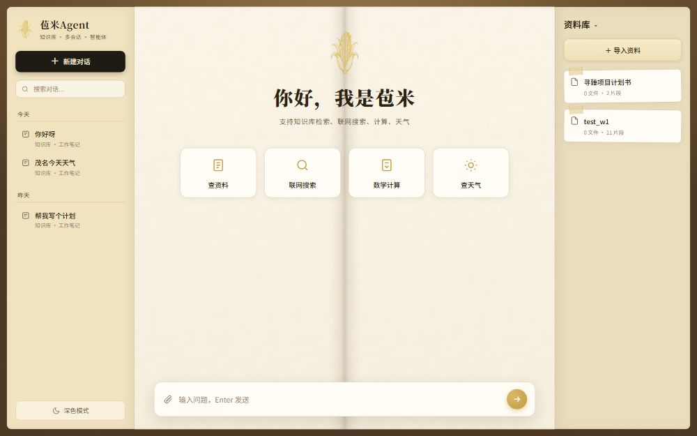
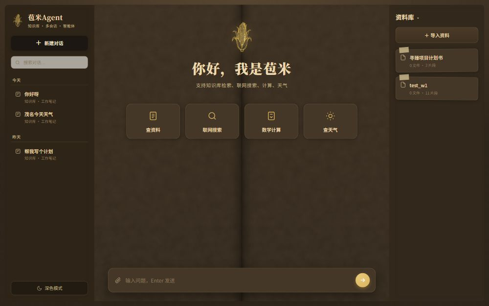

<div align="center">

# 🌽 苞米 Agent

**把 RAG 知识库、多会话和工具调用，装进一本摊开的纸质笔记本。**


| 浅色 · 暖米黄糙纸 | 深色 · 深棕木桌 |
|:---:|:---:|
|  |  |

</div>

---

## 它能做什么

**知识库问答，带出处。** 上传 txt / Markdown / PDF，切片、向量化、检索、生成一条龙。回答里的 `[1][2]` 角标能跳回原文片段；知识库里没有的，它会明说，不硬编。

**多会话，各管各的。** 新建、切换、重命名、删除；每个会话有独立历史，可以绑定不同的知识库。聊完第一轮，标题自动起好。

**四种回答模式。** `auto` 自己判断走检索还是走 Agent，也可以手动锁死 `rag` / `agent` / `llm`。

**会调工具。** 联网搜索（DuckDuckGo）、数学计算、天气查询（高德 + Open-Meteo 双源）。调了哪个工具、传了什么参数，界面上实时可见。

**联网资料直接入库。** 给一个 URL 就能抓进来；也可以先搜索预览，勾选之后批量导入，网页正文自动清洗成知识片段。

**流式到字节。** 全链路 SSE：状态提示、工具调用、增量 token、引用角标、会话标题，全是流式推送，不用干等。

## 🎨 一本笔记本该有的样子

界面没走 SaaS 后台的路子。它是暖米黄的糙纸、深棕的墨、一点成熟的玉米金（`#C8892A`）——金只做点缀，很克制。中间有一道书脊装订线，知识库卡片像贴在本子上的便签，输入框旁边别着一枚回形针。

这套视觉不是拍脑袋画的，背后有一套完整的设计令牌体系：

- 明暗双主题：暖米黄纸 ↔ 深棕木桌，一键切换
- 明度三级阶梯、圆角四档、字号七档、中性填充四级
- 语义色成对出现：实心版压白字，文字版上纸底，逐档验过 WCAG AA（≥4.5:1）
- 令牌体系参照 [LobeHub 的 DESIGN.md](https://github.com/lobehub/lobehub) 做过逐层对照，过程记录在 [`docs/设计令牌对照_LobeHub.md`](docs/设计令牌对照_LobeHub.md)

## 🚀 快速开始

**Windows 一键启动**：双击 `start.bat`，后端 `:8000` + 前端 `:3000` 一起起。

**手动启动**：

```bash
# 1. 后端
pip install -r requirements.txt

# 2. 配置密钥：复制 .env.example 为 .env，填入你的 key
python main.py                # 后端 http://localhost:8000

# 3. 前端（另开一个终端）
cd frontend
npm install
npm run dev                   # 前端 http://localhost:3000
```

需要配置的密钥：

| 变量 | 必填 | 用途 |
|---|:---:|---|
| `DEEPSEEK_API_KEY` | ✅ | 对话模型（DeepSeek） |
| `EMBEDDING_API_KEY` | ✅ | 文档向量化（阿里百炼 DashScope） |
| `AMAP_API_KEY` | 可选 | 天气工具（高德地图） |
| `SERPER_API_KEY` | 可选 | 联网搜索备选 |

健康检查：`GET http://localhost:8000/health`

> 版本锁死的坑：`langchain-chroma 1.x` 要求 `chromadb 1.x`，部分环境装不上。本项目固定用
> `langchain-chroma==0.2.3 + chromadb==0.5.23`，两者互相兼容，别单独升级其中一个。

## 🏗️ 技术栈

| 层 | 选型 |
|---|---|
| 对话模型 | DeepSeek `deepseek-chat`（OpenAI 兼容接口） |
| 向量化 | 阿里百炼 `text-embedding-v3` |
| Agent 框架 | LangChain `create_agent` + LangGraph（MemorySaver checkpoint） |
| 向量库 | Chroma（多 collection 隔离） |
| 会话存储 | SQLite（WAL 模式，参数化查询，10 轮窗口截断） |
| 后端 | FastAPI + uvicorn + sse-starlette |
| 联网搜索 | DuckDuckGo |
| 天气 | 高德地图 + Open-Meteo 双数据源 |
| 前端 | Next.js 16 · React 19 · Tailwind CSS v4 · LXGW WenKai |

## 📁 目录结构

```
苞米agent/
├── main.py                # FastAPI 入口（路由挂载 / CORS / 配置检查）
├── core/
│   ├── config.py          # 集中配置（密钥 / 路径 / 默认参数）
│   ├── llm.py             # get_llm() / get_embeddings()
│   └── session.py         # SQLite 会话 / 消息存储
├── kb/
│   ├── rag_core.py        # RagPipeline（加载/切片/建库/检索/生成）
│   ├── pipelines.py       # 多知识库动态注册表
│   └── importer.py        # 联网导入（URL 抓取 / 搜索预览）
├── agent/
│   ├── builder.py         # build_agent()（create_agent + 4 工具）
│   └── tools.py           # kb_search / web_search / calculator / get_weather
├── api/
│   ├── chat.py            # SSE 流式问答（auto / rag / agent / llm）
│   ├── kb.py              # 知识库路由
│   ├── sessions.py        # 会话 CRUD
│   └── schemas.py         # Pydantic 模型
├── frontend/              # Next.js 16 前端（苞米地笔记本主题）
│   └── src/app/styles/    # 设计令牌与全套样式
├── docs/                  # 设计文档 / 审查报告 / 截图
└── tests/                 # W1–W3 全链路测试
```

## 🔌 API 一览

<details>
<summary><b>会话 <code>/api/sessions/</code></b></summary>

| 方法 | 路径 | 说明 |
|---|---|---|
| POST | `/` | 新建会话（`{title, kb_id?}`） |
| GET | `/` | 列出所有会话（按更新时间倒序） |
| GET | `/{sid}/` | 会话详情 + 消息历史 |
| PATCH | `/{sid}/` | 重命名 / 绑定知识库（`kb_id` 传 `null` 解绑） |
| DELETE | `/{sid}/` | 删除会话 |

</details>

<details>
<summary><b>知识库 <code>/api/kb/</code></b></summary>

| 方法 | 路径 | 说明 |
|---|---|---|
| POST | `/{kb_id}/upload` | 上传文件（txt/md/pdf，多文件）并重建索引 |
| POST | `/{kb_id}/query` | 同步问答（返回 `{answer, refs}`） |
| GET | `/` | 列出所有知识库 |
| GET | `/{kb_id}/` | 查看库状态（chunks / 参数 / 文件） |
| DELETE | `/{kb_id}/` | 删除知识库 |
| POST | `/import-search` | 联网搜索预览（返回候选 URL） |
| POST | `/{kb_id}/import-url` | 抓取单个 URL 入库 |
| POST | `/{kb_id}/import-batch` | 批量抓 URL 入库 |

</details>

<details>
<summary><b>流式问答 <code>/api/chat/stream</code>（SSE）</b></summary>

请求体：`{sid, question, top_k?, kb_id_override?, mode?}`，`mode` 默认 `auto`（绑定知识库且非空走 RAG，否则走 Agent）。

事件协议：

| event | data | 说明 |
|---|---|---|
| `status` | `{text}` | 状态提示 |
| `tool` | `{name, input?, output?}` | Agent 工具调用 / 返回 |
| `token` | `{text, refs}` | 增量 token（`text` 为累计全文） |
| `title` | `{title}` | 自动生成的会话标题（仅首轮） |
| `done` | `{answer, refs, title, mode}` | 轮次结束 |
| `error` | `{detail}` | 错误信息 |

</details>

<details>
<summary><b>其他</b></summary>

| 方法 | 路径 | 说明 |
|---|---|---|
| GET | `/api/config/defaults` | 前端默认参数（chunk_size / top_k 等） |
| GET | `/health` | 健康检查 |

</details>

## 🧪 测试

```bash
python tests/test_w1.py   # RAG 全链路
python tests/test_w2.py   # 会话 + SSE 流式
python tests/test_w3.py   # Agent 多工具 + 联网导入（需先启动后端）
```

## 🗺️ 路线图

项目起自一份 8 周课程的三次作业（RAG、会话、Agent），后来长成了现在这个样子。

- **W1** RAG 全链路 ✅
- **W2** SQLite 多会话 + SSE 流式 ✅
- **W3** Agent + 4 工具 + 联网导入 ✅
- **W4** 前端界面（苞米地笔记本主题，明暗双态）✅
- **W5** 打磨交付 🚧 —— 设计令牌已收敛四轮（填充 / 字号 / 语义色 / 间距），剩余：流式字号自适应、字体自托管、赞踩反馈接口

---

<div align="center">

🌽 苞米 Agent · 知识库 · 多会话 · 智能体

</div>
