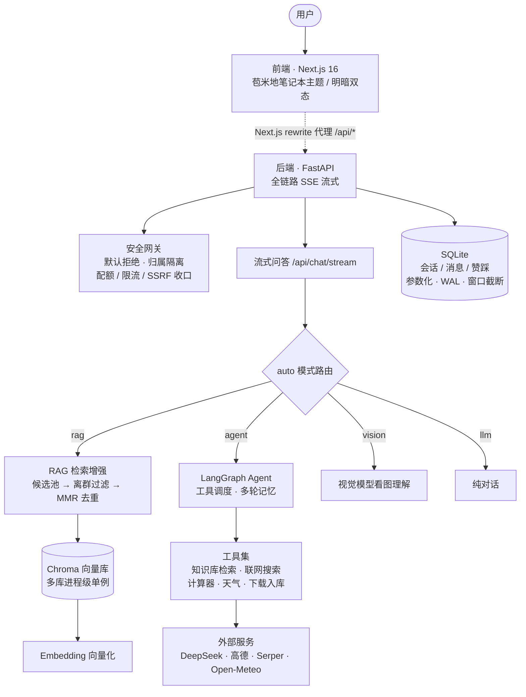

<div align="center">

# 🌽 苞米 Agent

**把 RAG 知识库、多会话和工具调用，装进一本摊开的纸质笔记本。**


| 浅色 · 暖米黄糙纸 | 深色 · 深棕木桌 |
|:---:|:---:|
|  |  |

</div>

---

## 它能做什么

**知识库问答，带出处。** 上传 txt / Markdown / PDF，切片、向量化、检索、生成一条龙。回答里的 `[1][2]` 角标能点开原文片段核对；知识库里没有的，它会明说，不硬编。

检索不是简单取 top-k。先从候选池（默认 3 倍）捞回来，丢掉余弦相似度明显偏低的，再用 MMR 去掉互相重复的相邻切片，最后截到 top-k —— 避免「三条引用里两条是同一段话」把名额占满。

**多会话，各管各的。** 新建、切换、重命名、删除；每个会话有独立历史，可以绑定不同的知识库。聊完第一轮，标题自动起好。回答可以赞/踩，反馈按消息 id 落到库里。

**四种回答模式。** `auto` 自己判断走检索还是走 Agent，也可以手动锁死 `rag` / `agent` / `llm`。

**会调工具，五个。** 知识库检索、联网搜索（Serper）、数学计算、天气查询（高德 + Open-Meteo 双源）、文件下载入库。调了哪个工具、传了什么参数、返回了什么，界面上实时可见。

**图片也看得懂。** 输入框别上一枚回形针，发图片走视觉模型理解；绑了知识库的话，检索结果会一并拼进上下文。

**联网资料直接入库。** 给一个 URL 就能抓进来；也可以先搜索预览，勾选之后批量导入，网页正文自动清洗成知识片段。

**流式到字节。** 全链路 SSE：状态提示、工具调用、增量 token、引用角标、会话标题，全是流式推送，不用干等。

**问天气不用报城市。** 开了定位就自动带上。这条链路做过专门降级：浏览器定位（HTTPS / localhost 才有）→ 服务端按来源 IP 推断城市 → 手动输入，三级都不会卡死你。

**模板广场（面向大学生）。** 不想从空白会话开始？挑一个校园场景模板（考研 / 论文 / 期末 / 求职 / 四六级 / 社团 / 文献 …），一键建好专属知识库 + 会话并预填引导问题，30 秒上手。每个模板都强调「辅助而非替代」——这是为学习而生的 AI 素养平台。详见 [`docs/可行性分析_大学生智能体平台_2026-10-10.md`](docs/可行性分析_大学生智能体平台_2026-10-10.md)。

## 🎨 一本笔记本该有的样子

界面没走 SaaS 后台的路子。它是暖米黄的糙纸、深棕的墨、一点成熟的玉米金（`#C8892A`）—— 金只做点缀，很克制。中间有一道书脊装订线，知识库卡片像贴在本子上的便签，输入框旁边别着一枚回形针。

这套视觉不是拍脑袋画的，背后有一套完整的设计令牌体系：

- 明暗双主题：暖米黄纸 ↔ 深棕木桌，一键切换
- 明度三级阶梯、圆角四档、字号七档、中性填充四级
- 语义色成对出现：实心版压白字，文字版上纸底，逐档验过 WCAG AA（≥4.5:1）
- 令牌体系参照 [LobeHub 的 DESIGN.md](https://github.com/lobehub/lobehub) 做过逐层对照，过程记录在 [`docs/设计令牌对照_LobeHub.md`](docs/设计令牌对照_LobeHub.md)

## 🚀 快速开始

**Windows 一键启动**：双击 `start.bat`，后端 `:8000` + 前端 `:3000` 一起起。

**手动启动**：

```bash
# 1. 后端
pip install -r requirements.txt

# 2. 配置密钥：复制 .env.example 为 .env，填入你的 key
python main.py                # 后端 http://localhost:8000

# 3. 前端（另开一个终端）
cd frontend
npm install
npm run dev                   # 前端 http://localhost:3000
```

前端的 `/api/*` 请求会由 Next.js rewrite 代理到后端，所以不用配跨域，也不用在前端写后端地址。

需要配置的密钥：

| 变量 | 必填 | 用途 |
|---|:---:|---|
| `DEEPSEEK_API_KEY` | ✅ | 对话模型（DeepSeek） |
| `EMBEDDING_API_KEY` | ✅ | 文档向量化（阿里百炼 DashScope） |
| `EMBEDDING_BASE_URL` | ✅ | 向量化服务地址（ OpenAI 兼容端点） |
| `AMAP_API_KEY` | 可选 | 天气工具 + 逆地理（高德地图） |
| `SERPER_API_KEY` | 可选 | 联网搜索（Serper） |
| `VISION_API_KEY` | 可选 | 图片理解，不填时回落到 `EMBEDDING_API_KEY` |

健康检查：`GET http://localhost:8000/health`

> 版本锁死的坑：`langchain-chroma 1.x` 要求 `chromadb 1.x`，部分环境装不上。本项目固定用
> `langchain-chroma==0.2.3 + chromadb==0.5.23`，两者互相兼容，别单独升级其中一个。

## 🛠️ 部署到服务器

项目自带 `deploy.sh`，一条命令完成拉代码、装依赖、构建前端、重启服务：

```bash
bash deploy.sh start      # 首次部署
bash deploy.sh deploy     # 完整更新（动了 frontend/src/** 必须用这条）
bash deploy.sh restart    # 只改了 Python，跳过前端构建
bash deploy.sh status     # 看服务状态
bash deploy.sh logs       # 看日志
```

详细流程、踩坑记录和报错对照表见 [`部署说明.md`](部署说明.md)。

## 🏛️ 系统架构



> 设计要点：前端只跟后端说话（同源代理，无需配 CORS）；后端**默认要登录**，每个业务端点都挂了鉴权依赖；多用户数据按 `owner` 强制隔离，归属校验失败返回 404 而非 403，避免 id 可枚举。

## 🏗️ 技术栈

| 层 | 选型 |
|---|---|
| 对话模型 | DeepSeek `deepseek-chat`（OpenAI 兼容接口） |
| 视觉模型 | 阿里百炼 `qwen-vl-plus`（图片理解） |
| 向量化 | 阿里百炼 `text-embedding-v3` |
| Agent 框架 | LangChain `create_agent` + LangGraph（**不挂 checkpoint**，记忆交给 SQLite） |
| 向量库 | Chroma（多 collection 隔离，进程级单例） |
| 会话存储 | SQLite（WAL 模式，参数化查询，10 轮窗口截断） |
| 后端 | FastAPI + uvicorn，SSE 手写 `StreamingResponse` |
| 联网搜索 | Serper API |
| 天气 | 高德地图 + Open-Meteo 双数据源 |
| 前端 | Next.js 16 · React 19 · Tailwind CSS v4 · LXGW WenKai |

> **为什么不用 LangGraph checkpoint**：会话历史本来就在 SQLite 里，每轮重放给模型。
> 再挂一个 checkpoint 等于记两份，实测会让消息**重复累积**（3 轮后状态 12 条，本应 6 条）。
> 用 DB 当唯一事实来源反而更稳：重启不丢、受窗口截断保护、不额外加依赖。
> 完整论证在 `agent/builder.py:_make_checkpointer()` 的注释里。

## 📁 目录结构

```
苞米agent/
├── main.py                # FastAPI 入口（路由挂载 / CORS / 尾斜杠归一中间件）
├── core/
│   ├── config.py          # 集中配置（密钥 / 路径 / 检索策略参数）
│   ├── llm.py             # get_llm() / get_embeddings() / get_vision_llm()
│   ├── session.py         # SQLite 会话 / 消息 / 赞踩存储
│   └── upload.py          # 流式上传（大小预检 + 分块写盘 + 失败清理）
├── kb/
│   ├── rag_core.py        # RagPipeline + Chroma 单例 + select_diverse 检索重排
│   ├── pipelines.py       # 多知识库注册表（按库并发锁 / 原子写文件清单）
│   └── importer.py        # 联网导入（Serper 搜索 / URL 抓取 / 文件下载）
├── agent/
│   ├── builder.py         # build_agent()（create_agent + 5 工具）
│   └── tools.py           # kb_search / web_search / calculator / get_weather / download_file
├── api/
│   ├── chat.py            # SSE 流式问答（vision / rag / agent / llm）
│   ├── kb.py              # 知识库路由（上传 / 文件级管理 / 重建 / 导入）
│   ├── sessions.py        # 会话 CRUD + 整轮删除
│   ├── feedback.py        # 赞踩反馈
│   ├── geo.py             # 公网 http 下的服务端 IP 定位兜底
│   └── schemas.py         # Pydantic 模型
├── tools/                 # 性能压测脚本（stress_test.py / stress_live.py）
├── frontend/              # Next.js 16 前端（苞米地笔记本主题）
│   └── src/app/styles/    # 设计令牌与全套样式
├── deploy.sh              # 服务器一键部署 / 更新
├── docs/                  # 设计文档 / 视觉审查 / 每日扫描报告 / 截图
└── tests/                 # W1–W3 全链路 + 7 个离线回归
```

## 🔌 API 一览

<details>
<summary><b>会话 <code>/api/sessions/</code></b></summary>

| 方法 | 路径 | 说明 |
|---|---|---|
| POST | `/` | 新建会话（`{title, kb_id?}`） |
| GET | `/` | 列出所有会话（按更新时间倒序） |
| GET | `/{sid}/` | 会话详情 + 消息历史（最近 10 轮） + 全量 `message_count` |
| PATCH | `/{sid}/` | 重命名 / 绑定知识库（`kb_id` 传 `null` 解绑） |
| DELETE | `/{sid}/` | 删除会话 |
| DELETE | `/{sid}/messages/{msg_id}/` | 删除这一整轮（user + 后续 assistant） |

</details>

<details>
<summary><b>知识库 <code>/api/kb/</code></b></summary>

| 方法 | 路径 | 说明 |
|---|---|---|
| POST | `/create` | 登记知识库（中文名亦可），返回内部 `kb_id` |
| GET | `/` | 列出所有知识库（含片段数与文件清单） |
| GET | `/{kb_id}/` | 查看库状态（chunks / 切片参数 / 文件） |
| DELETE | `/{kb_id}/` | 删除知识库（连原始留档一起清） |
| POST | `/{kb_id}/upload` | 上传 txt/md/pdf，`mode=append`（默认）或 `rebuild` |
| GET | `/{kb_id}/files` | 列出库内文件 |
| DELETE | `/{kb_id}/files` | 删除单个文件（清片段 + 删留档 + 更新清单） |
| GET | `/{kb_id}/file-content` | 预览文件正文（优先读留档，老库从向量片段拼回） |
| POST | `/{kb_id}/rebuild` | 按新切片参数重建整库 |
| POST | `/{kb_id}/query` | 同步问答（返回 `{answer, refs}`） |
| POST | `/import-search` | 联网搜索预览（返回候选 URL 供勾选） |
| POST | `/{kb_id}/import-url` | 抓取单个 URL 入库 |
| POST | `/{kb_id}/import-batch` | 批量抓 URL 入库 |
| GET | `/download` | 把远程文档代理下载到浏览器 |

</details>

<details>
<summary><b>流式问答 <code>/api/chat/stream</code>（SSE）</b></summary>

请求体：`{sid, question, top_k?, kb_id_override?, mode?, attachments?, location?}`
`mode` 默认 `auto`（绑定了非空知识库走 RAG，否则走 Agent）；带图片附件时自动进 `vision` 分支。

事件协议：

| event | data | 说明 |
|---|---|---|
| `status` | `{text}` | 进度提示（正在检索 / 检索到 N 条 / 正在生成…） |
| `tool` | `{name, input?}` / `{name, output?}` | Agent 工具调用发起 / 返回 |
| `sources` | `{items: [...]}` | 引用溯源条目（含 `score` 余弦相似度、原文片段） |
| `token` | `{text}` | **增量** token，前端自己累加（`text` 不是全文） |
| `title` | `{title}` | 自动生成的会话标题（仅首轮） |
| `done` | `{answer, refs, title, mode, message_id}` | 轮次结束，`message_id` 供赞踩按 id 落库 |
| `error` | `{detail}` | 错误信息（已翻译成中文，不吐英文栈） |

</details>

<details>
<summary><b>其他</b></summary>

| 方法 | 路径 | 说明 |
|---|---|---|
| POST | `/api/chat/upload` | 上传聊天附件（图片），返回服务端路径供视觉模型消费 |
| POST | `/api/feedback/` | 赞踩反馈（`{sid, message_id, rating}`） |
| GET | `/api/geo/locate` | 服务端按来源 IP 推断城市（浏览器定位不可用时的兜底） |
| GET | `/api/config/defaults` | 前端默认参数（chunk_size / chunk_overlap / top_k） |
| GET | `/health` | 健康检查 |

</details>

## 🧪 测试

```bash
python tests/test_w1.py   # RAG 全链路（需后端已启动）
python tests/test_w2.py   # 会话 + SSE 流式（需后端已启动）
python tests/test_w3.py   # Agent 多工具 + 联网导入（需后端已启动）
```

另有 7 个**离线回归**（不联网、不起服务，跑几十毫秒，专门盯住踩过的坑）：

```bash
python tests/test_retrieve_select.py      # 检索三段式重排（含相似度换算守卫）
python tests/test_chroma_singleton.py     # Chroma 客户端单例
python tests/test_upload_stream.py        # 上传分块写盘 + 失败清理
python tests/test_pipelines_concurrency.py# 多库并发读写
python tests/test_slash_no_redirect.py    # 尾斜杠不再 307
python tests/test_agent_checkpointer.py   # 确认不挂 checkpoint
python tests/test_geo_locate.py           # IP 定位三级降级
```

## 📊 性能实测

`tools/stress_test.py`（留档用）/ `tools/stress_live.py`（现场演示，**零第三方依赖**）。
以下为阿里云 2 核 2G 机器上的实测基线，**全程 0 失败**：

| 场景 | 并发 | P50 |
|---|---|---|
| 只读接口 | 8 | 33.7 ms |
| SSE 问答（端到端） | 3 | 1.64 s |
| 文档上传 | 3 | 2.78 s |

并发从 1 涨到 3，问答延迟基本持平，说明没有排队。上传那条接近线性，瓶颈在外部向量化接口。

## 🗺️ 路线图

项目起自一份 8 周课程的三次作业（RAG、会话、Agent），后来长成了现在这个样子。

- **W1** RAG 全链路 ✅
- **W2** SQLite 多会话 + SSE 流式 ✅
- **W3** Agent + 5 工具 + 联网导入 ✅
- **W4** 前端界面（苞米地笔记本主题，明暗双态）✅
- **W5** 打磨交付 🚧 —— 设计令牌已收敛四轮（填充 / 字号 / 语义色 / 间距）；赞踩反馈已打通；
  剩余：流式字号自适应、字体自托管（去掉 CDN 外链）、会话历史分页加载

每日的代码扫描报告在 `docs/前后端可更新点_YYYY-MM-DD.md`，里面记了每一轮查出来的问题、
哪些已修、哪些还欠着 —— 包括踩过的坑和当时的实测数据。

---

<div align="center">

🌽 苞米 Agent · 知识库 · 多会话 · 智能体

</div>
